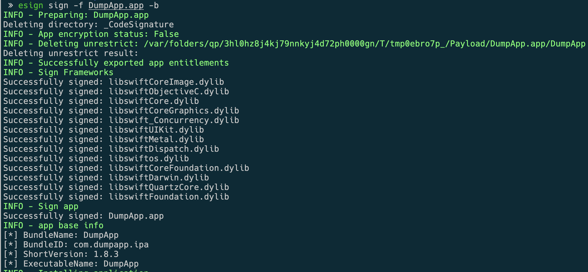
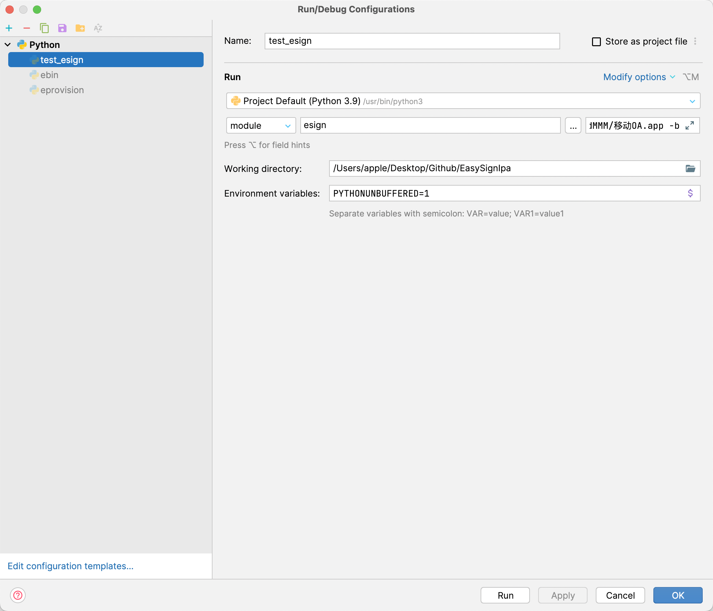

# **[中文] | [English](./README_EN.md)**

### EasySignIpa



> 重签名 iOS 的 IPA 文件的命令行工具
> `IPA文件需要是咂壳后的包`

### 准备

- macOS
- Xcode
- Python 3.8+

### 安装

```python
git clone https://github.com/DargonLee/EasySignIpa
cd EasySignIpa
python setup.py install_command
pip install .
```

### 示范用例

##### 更新描述文件

```py
esign update -m debug /Users/xxx/Desktop/xxxx.mobileprovision
esign update -m release /Users/xxx/Desktop/xxxx.mobileprovision
```

##### 更新证书identity值

```py
esign update -m debug 40900B2051FAAB6FED2BCB35C6A42A7C7CE821C1
esign update -m release 40900B2051FAAB6FED2BCB35C6A42A7C7CE821C2
```


##### 重签名并输出重签后的文件

```python
# ipa 文件输出
esign sign -f /Users/xxx/Desktop/xxx.ipa -o /Users/xxx/Desktop/1.ipa
# app 文件输出
esign sign -f /Users/xxx/Desktop/xxx.app -o /Users/xxx/Desktop/
```

##### 重签名并输出重签后的文件，同时自动安装到手机

> 注意⚠️：手机要和电脑通过 USB 连接正常

```python
# ipa 文件输出 并安装
esign sign -f /Users/xxx/Desktop/xxx.ipa -o /Users/xxx/Desktop/ -b
# app 文件输出 并安装
esign sign -f /Users/xxx/Desktop/xxx.app -o /Users/xxx/Desktop/ -b
```

##### 重签名后自动安装到手机

> 注意⚠️：手机要和电脑通过 USB 连接正常

```python
# ipa 文件安装
esign sign -f /Users/xxx/Desktop/xxx.ipa -b
# app 文件安装
esign sign -f /Users/xxx/Desktop/xxx.app -b
```

##### 重签名后先卸载手机上已经安装同一包名的 App 然后再安装

> 注意⚠️：手机要和电脑通过 USB 连接正常

```python
# ipa 文件重新安装
esign sign -f /Users/xxx/Desktop/xxx.ipa -rb
# app 文件重新安装
esign sign -f /Users/xxx/Desktop/xxx.app -rb
```

##### 重签名 App 并注入动态库

```python
# 动态库
esign sign -f /Users/xxx/Desktop/xxx.ipa -l /Users/xxx/Desktop/xxx.dylib -l /Users/xxx/Desktop/yyy.framework
```

##### 重签名 App 并注入动态库并安装到手机

```python
# 安装
esign sign -f /Users/xxx/Desktop/xxx.ipa -l /Users/xxx/Desktop/xxx.dylib -b
# 重新安装
esign sign -f /Users/xxx/Desktop/xxx.ipa -l /Users/xxx/Desktop/xxx.framework -rb
```

### Pycharm Debug


